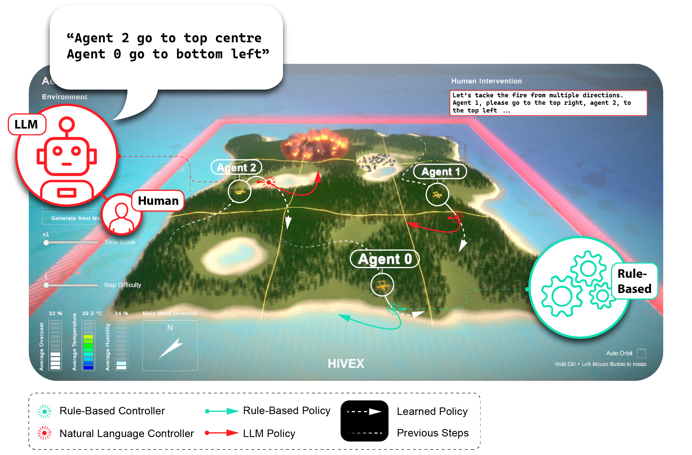

<div align="center">
  
</div>

<br>

# LLM-Mediated Guidance for MARL Systems

_Rule-Based and Natural Language Interventions for Multi-Agent Reinforcement Learning_

## About

The motivation of this work is to demonstrate how LLM and human expert guidance and an LLM-Mediator could be utilize to guide Reinforcement Learning agents in Multi-Agent Systems to improve traininf efficientcy and performance.

## ⚡ Quick Overview (TL;DR)

- Download Aerial Wildfire Suppression [HIVEX Environments](https://github.com/hivex-research/hivex-environments)
- Reproducing LLM-Mediated Guidance for MARL Systems results: [Train-Pipeline Script](https://github.com/hivex-research/llm_mediated_guidance/blob/main/src/train_pipeline.py)
- [HIVEX Leaderboard](https://huggingface.co/spaces/hivex-research/hivex-leaderboard) on Huggingface 🤗
- [LLM-Mediated Guidance for MARL Systems result plots](https://github.com/hivex-research/hivex-results/tree/master/results/AerialWildfireSuppression/llm_mediated_guidance/plots) on GitHub :octocat:

## 🐍 Installation using Conda Virtual Environment (Recommended)

The installation steps are
as follows:

1. Create and activate a virtual environment, e.g.:

   ```shell
   conda create -n llm_mediated_guidance python=3.9 -y
   conda activate llm_mediated_guidance
   ```

2. Install `ml-agents`:

   ```shell
   pip install git+https://github.com/Unity-Technologies/ml-agents.git@release_20#subdirectory=ml-agents
   ```

3. Install `torch`:

   ```shell
   pip3 install torch torchvision torchaudio --index-url https://download.pytorch.org/whl/cu124
   ```

4. Install `llm_mediated_guidance`:

   ```shell
   git clone git@github.com:hivex-research/llm_mediated_guidance.git
   cd llm_mediated_guidance
   pip install -e .
   ```

### Adding/Updating dependencies

To add further dependencies, add them to the corresponding `*.in` file in the `./requirements` folder and re-compile using `pip-compile-multi`:

```shell
pip install pip-compile-multi
pip-compile-multi --autoresolve
```

## 🌍 Aerial Wildfire Suppression Environment Specs

Observations:

```shell
Visual: (42 x 42 x 3)
Vector: (8)
position: x
position: y
direction: x
direction: y
holding water: [True, False]
closest observed fire location: x
closest observed fire location: y
fire state [not_burning, burning]
```

Actions:

```shell
1       Continous Action (-1 to +1) - this is steering left, steering right
1       discrete Action branch with two possibilities (0 or 1) - this is dropping water if held
```

Re-Shaped Rewards:

```shell
0       for when fire is extinguished
-100    if crossed red boundary
+1000   for every extinguished burnign tree: state change burning -> wet
+0.1    for every tree prepared / used as barrier to block fire from growing: state change existing -> wet
0       for fire too close to village
+0.1    for picking up water
```

## Intervention

## 🧪 Reproducing Paper Results

### Install dependencies:

1. Install dependencies as described in the [🐍 Installation using Conda Virtual Environment (Recommended)](#installation-using-conda-virtual-environment-recommended) section.

## 🌍 Download HIVEX Environments

### Download / Clone binaries locally

1. Download the HIVEX Aeial Wildfire Suppression environment binaries for your operating system from the [hivex-environments](https://github.com/hivex-research/hivex-environments) repository:

   ```shell
   git clone git@github.com:hivex-research/hivex-environments.git
   ```

2. Please make sure to un-zip the environment folder.

   This is what the environment paths need to look like (windows):

   - `env/Hivex_AerialWildfireSuppression_win/Hivex_AerialWildfireSuppression.exe`

Note: If you want to use a custom directory for your environments and use the `train_pipeline.py`, please adjust the directory global at the top of the script.

### Train using RLLib

Start train pipeline:

```shell
python src/train_pipeline.py
```

### 📊 Results

All results can be found in the [hivex-results](https://github.com/hivex-research/hivex-results/tree/master/results/AerialWildfireSuppression/llm_mediated_guidance/plots) repository. Or on the [HIVEX Leaderboard](https://huggingface.co/spaces/hivex-research/hivex-leaderboard) on Huggingface 🤗. More details on the training runs can be found on [google drive](https://drive.google.com/drive/folders/1WJHPjskP96EnAJz8FI2R-rok1z5XBUW_), which we could not upload due to space constraints.

## ✨ Submit your own Results to the [HIVEX Leaderboard](https://huggingface.co/spaces/hivex-research/hivex-leaderboard) on Huggingface 🤗

1. Install all dependencies as described [above](#installation-using-conda-virtual-environment-recommended).

2. Run the Train Pipeline with `src/train_pipeline.py`

3. Make sure your model matches the [baseline results with task 0 and difficulty 1](https://huggingface.co/hivex-research/hivex-AWS-PPO-baseline-task-0-difficulty-1) model format. :warning: Because the LLM Guidance work has shaped the rewards, please only submit `Crash Count`,
   `Extinguishing Trees`, `Fire Out`, `Fire too Close to City`, `Preparing Trees`, `Water Drop` and `Water Pickup` results.

**Congratulations, you did it 🚀!**

## 📝 Citing LLM-Mediated Guidance for MARL Systems

If you are using hivex in your work, please cite:

```bibtex
@software{,
   author={},
   title={},
   year={},
   month={},
   url={},
}
```
