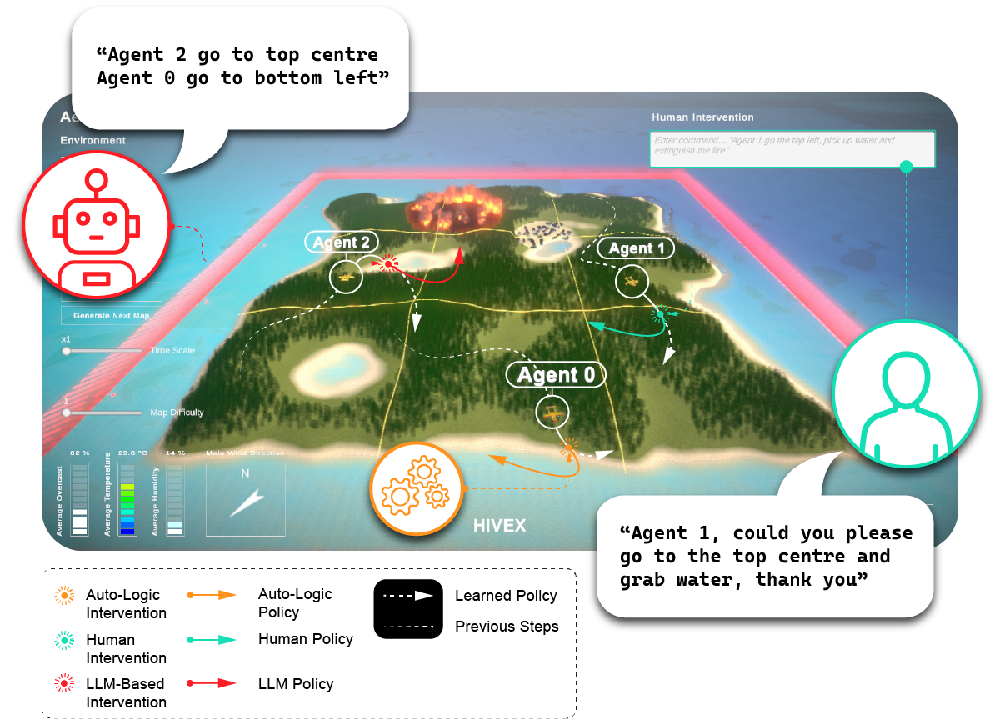

<div align="center">
  
</div>

# HIVEX

_Human and LLM-Based Intervention for Multi-Agent Reinforcement Learning Framework._

## About

The motivation of this work is to demonstrate how human experts and LLMs could be utilize to guide Reinforcement Learning agents in Multi-Agent Systems to improve traininf efficientcy and performance.

## ⚡ Quick Overview (TL;DR)

- Download Aerial Wildfire Suppression [HIVEX Environments](https://github.com/hivex-research/hivex-environments)
- Reproducing HIVEX baselines results: [Train-Test-Pipeline Script](https://github.com/hivex-research/hivex/blob/main/src/TODO/src/rain.py)
- [HIVEX Leaderboard](https://huggingface.co/spaces/hivex-research/hivex-leaderboard) on Huggingface 🤗
- [HIVEX result plots](https://github.com/hivex-research/hivex-results) on GitHub :octocat:

## 🐍 Installation using Conda Virtual Environment (Recommended)

The installation steps are
as follows:

1. Create and activate a virtual environment, e.g.:

   ```shell
   conda create -n TODO python=3.9 -y
   conda activate TODO
   ```

2. Install `ml-agents`:

   ```shell
   pip install git+https://github.com/Unity-Technologies/ml-agents.git@release_20#subdirectory=ml-agents
   ```

3. Install `torch`:

   ```shell
   pip3 install torch torchvision torchaudio --index-url https://download.pytorch.org/whl/cu124
   ```

4. Install `TODO`:

   ```shell
   git clone git@github.com:hivex-research/TODO.git
   cd TODO
   pip install -e .
   ```

### Adding/Updating dependencies

To add further dependencies, add them to the corresponding `*.in` file in the `./requirements` folder and re-compile using `pip-compile-multi`:

```shell
pip install pip-compile-multi
pip-compile-multi --autoresolve
```

## 🌍 Aerial Wildfire Suppression Environment Specs

Observations:

```shell
Visual: (42 x 42 x 3)
Vector: (8)
position: x
position: y
direction: x
direction: y
holding water: [True, False]
closest observed fire location: x
closest observed fire location: y
fire state [not_burning, burning]
```

Actions:

```shell
1       Continous Action (-1 to +1) - this is steering left, steering right
1       discrete Action branch with two possibilities (0 or 1) - this is dropping water if held
```

Reward:

```shell
-0.01   for every time step the fire is burning (3000 time steps total)
+10     for when fire is extinguished
-100    if crossed red boundary
+5      for every extinguished burnign tree: state change burning -> wet
+1      for every tree prepared / used as barrier to block fire from growing: state change existing -> wet
-50     for fire too close to village
+1      for picking up water
```

## Intervention

## 🧪 Reproducing Paper Results

### Install dependencies:

1. Install dependencies as described in the [🐍 Installation using Conda Virtual Environment (Recommended)](#installation-using-conda-virtual-environment-recommended) section.

### Train and Test using RLLib

Start train and test pipeline:

```shell
python src/train_test_pipeline.py
```

### 📊 TODO Results

All results can be found in the [hivex-results](https://github.com/hivex-research/hivex-results/TODO) repository. Or on the [HIVEX Leaderboard](https://huggingface.co/spaces/hivex-research/hivex-leaderboard) on Huggingface 🤗. More details on the exact training runs can be found on [google drive](https://drive.google.com/drive/folders/TODO), which we could not upload due to space constraints.

## ✨ Submit your own Results to the [HIVEX Leaderboard](https://huggingface.co/spaces/hivex-research/hivex-leaderboard) on Huggingface 🤗

1. Install all dependencies as described [above](#installation-using-conda-virtual-environment-recommended).

2. Run the Train and Test Pipeline with `src/train_test_pipeline.py`

TODO:

3. Clone the [hivex-results repository](https://github.com/hivex-research/hivex-results/tree/master).

4. In your local [hivex-results repository](https://github.com/hivex-research/hivex-results/tree/master), add your results to the respective environment/train and environment/test folders. We have provided a `train_dummy_folder` and `test_dummy_folder` with results for training and testing on the Wind Farm Control environment.

5. Run `find_best_models.py`

This script generates data from your results.

```shell
python tools/huggingface/find_best_models.py
```

6. Run `generate_hf_yaml.py`

Uncomment the environment data parser you need for your data. For example, for our dummy data, we need `generate_yaml_WFC(data['WindFarmControl'], key)`. This script takes the data generated in the previous step and turns it into folders including the checkpoint etc. of your training run and a `README.md`, which serves as the model card including important meta-data that is needed for the automatic fetching of the leaderboard of your model.

```shell
python tools/huggingface/generate_hf_yaml.py
```

7. Finally, upload the content of the generated folder(s) to Huggingface 🤗 as a new model.

8. Every 24 hours, the [HIVEX Leaderboard](https://huggingface.co/spaces/hivex-research/hivex-leaderboard) is fetching new models. We will review your model as soon as possible and add it to the verified list of models as soon as possible. If you have any questions, please feel free to reach out to p.d.siedler@gmail.com.

**Congratulations, you did it 🚀!**

## 📝 Citing HIVEX

If you are using hivex in your work, please cite:

# TODO:

```bibtex
@software{siedler_hi_marl_2024,
   author={Philipp D. Siedler},
   title={},
   year={2024},
   month={8},
   url={https://github.com/hivex-research/hivex},
}
```
